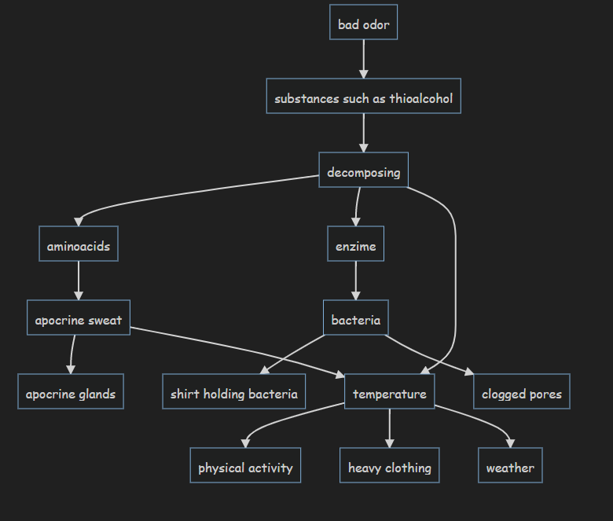

Instructions
- run 'npm install'
- move the folder to .obsidian/plugins
- in obsidian, open settings, community plugins, and turn the plugin on

This plugin previews an outline as a mermaid graph, and allows connections between elements.

Example

~~~
```mermaidmindmap
- bad odor[odor]
	- substances such as thioalcohol[substances]
		- decomposing[decomposing]
			- aminoacids[aminoacids]
				- apocrine sweat[sweat]
					- apocrine glands
			- enzime[enzime]
				- bacteria[bacteria]
					- shirt holding bacteria
					- clogged pores[clogged pores]
			- temperature[temperature]
				- physical activity
				- heavy clothing
				- weather

sweat-->temperature
```
~~~

Will be previewed as



~~~
```mermaidmindmap
- car
  - wheel[wheel]
  - motor
  - fuel
  - door
    - metal[metal]
- bicycle[bicycle]
  - frame[frame]

bicycle-->wheel
frame-->metal
```
~~~

Will be previewed as


## Idea behind plugin

- Mermaid syntax is overly complicated when you just want a tree-like structure
- Markmap syntax doesn't allow for connections outside of the outline as of December of 2021

## Is the plugin foolproof?

Definitely not

I created mermaid-mindmap.js on a whim and decided to turn it into an obsidian plugin. I didn't check all corner cases and I intend to do so when the plugin breaks.

Feel free to submit a pull request