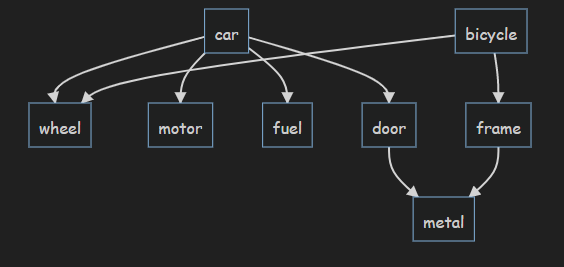

Instructions
- run 'npm install'
- move the folder to .obsidian/plugins

This plugin previews an outline as a mermaid graph, and allows connections between elements.

Example

```mermaidmindmap
- car
  - wheel[wheel]
  - motor
  - fuel
  - door
    - metal[metal]
- bicycle[bicycle]
  - frame[frame]

bicycle-->wheel
frame-->metal
```

Will be previewed as



## Idea behind plugin

- Mermaid syntax is overly complicated when you just want a tree-like structure
- Markmap syntax doesn't allow for connections outside of the outline as of December of 2021

## Is the plugin foolproof?

Definitely not

I created mermaid-mindmap.js on a whim and decided to turn it into an obsidian plugin. I didn't check all corner cases and I intend to do so when the plugin breaks.

Feel free to submit a pull request